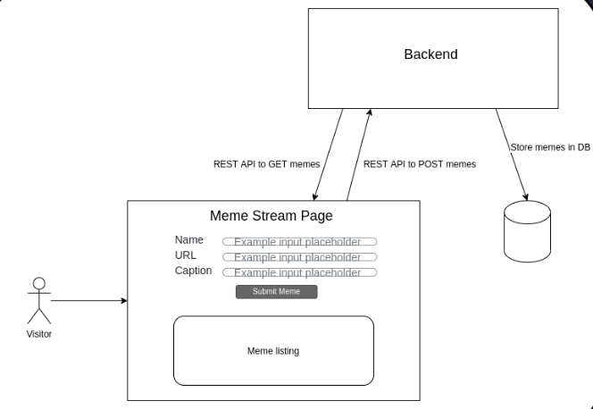

# xMeme
A Meme Stream Page where users can post memes by providing their name, a caption for the meme and the URL for the meme image as input. The page should retrieve and display the latest 100 posted Memes (names + meme images + caption).

This file can be used as a template for initializing and running spring projects.

What's included: 
1. Gradle file created from start.spring.io
2. Plugins for Spotbugs, Checkstyle and Jacoco included
3. Other dependencies like Mongo, MySql and redis.
4. Dockerfile to start mongo server and run the spring boot application within.

Usage - 

1. To build the repository - 

From the repository root, 

1. run `./gradlew build test`run the build
2. run `./gradlew bootjar` to create executable jar. The jar will be located inside build directories.

To run inside docker container, use below commands

To build docker image, use the command below - `docker build -t your_tag_name  .`

To run the generated container, use this command - `docker run -p8080:8080 your_tag_name`. This will run the server on 8080 port.. You can change the ports as per your needs.
